# SequenceDiagram
## 📌 잔액 충전
> 사용자의 포인트를 충전 합니다.
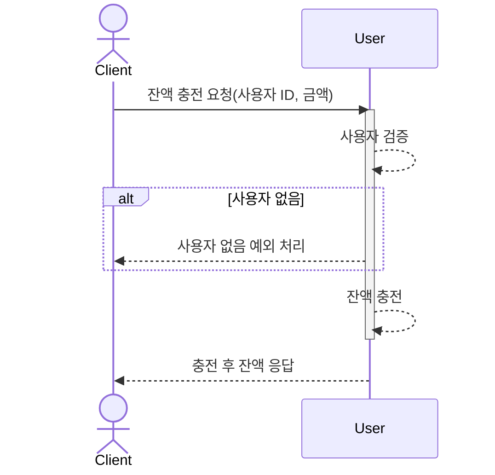
## 📌 잔액 조회
> 사용자의 포인트 잔액을 불러옵니다.
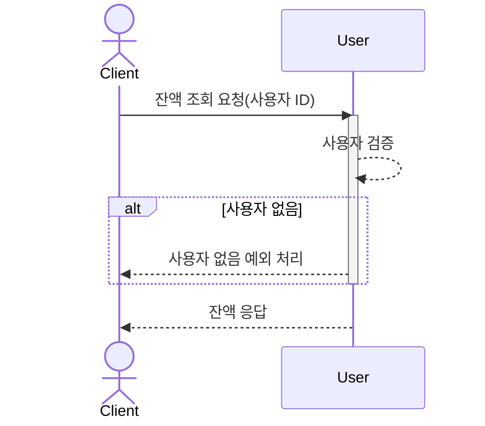

## 📌 상품 조회
> 구매 가능한 상품 목록을 불러옵니다.

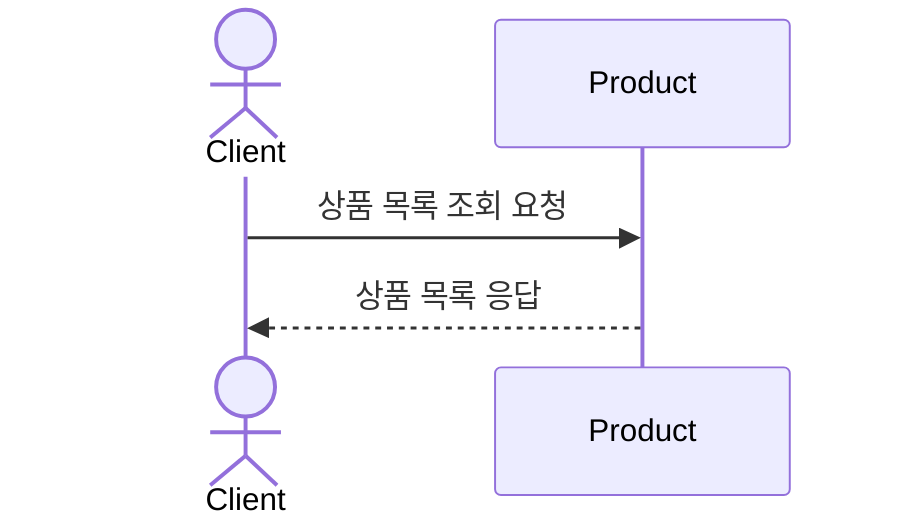
## 📌 사용자 쿠폰 조회
> 쿠폰을 조회 합니다.
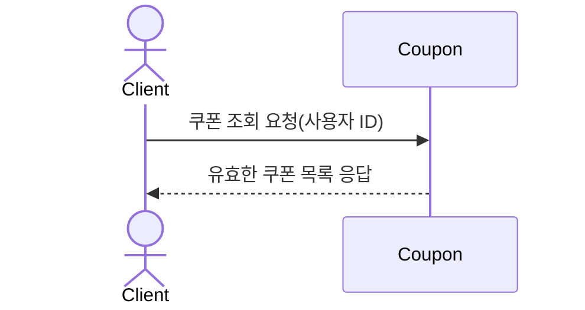

## 📌 쿠폰 발급
> 쿠폰을 선착순으로 발급합니다.
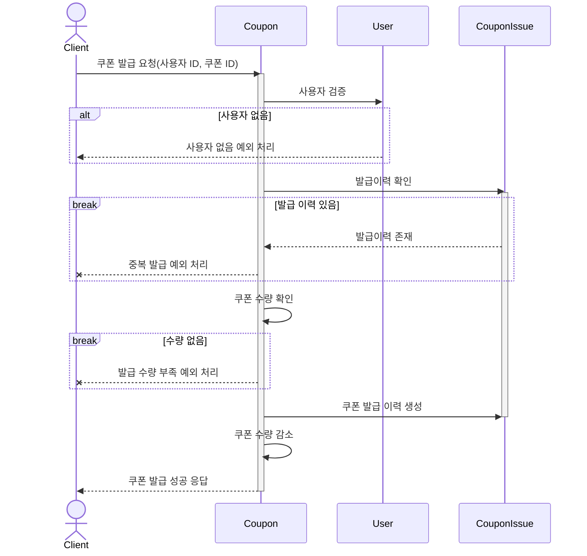

## 📌 장바구니 상품 추가
> 상품을 장바구니에 추가하고 수량을 관리합니다.
 
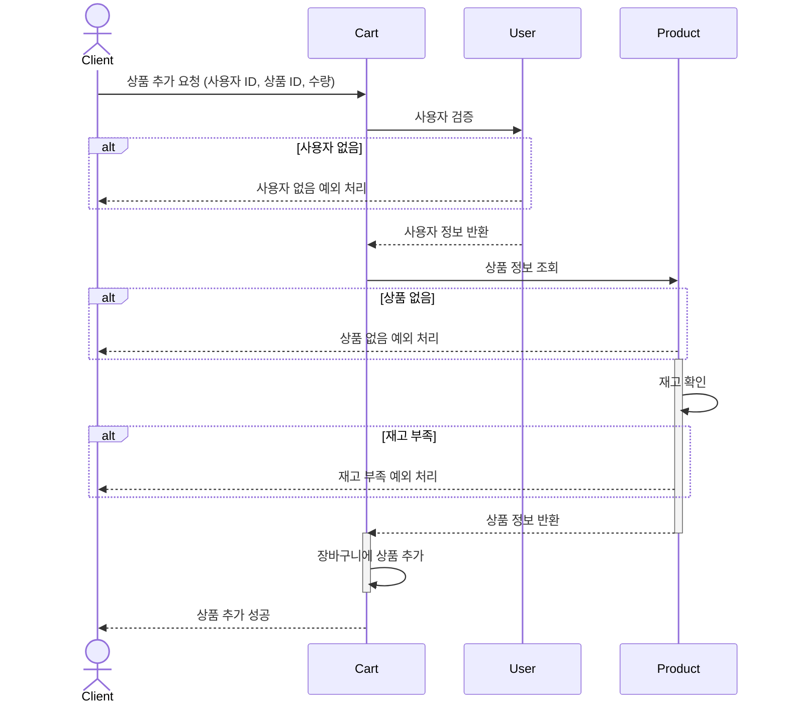

### 상태 다이어그램
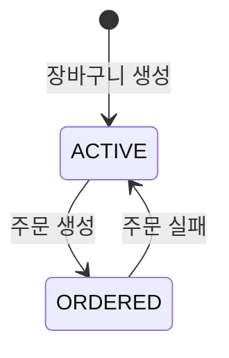

### 상태 enum
```java
/** 장바구니 상태 */
enum Cart {
    ACTIVE, // 장바구니 활성
    ORDERED // 주문 생성(장바구니 수정 불가)
}
```

## 📌 주문 
> 주문을 합니다.

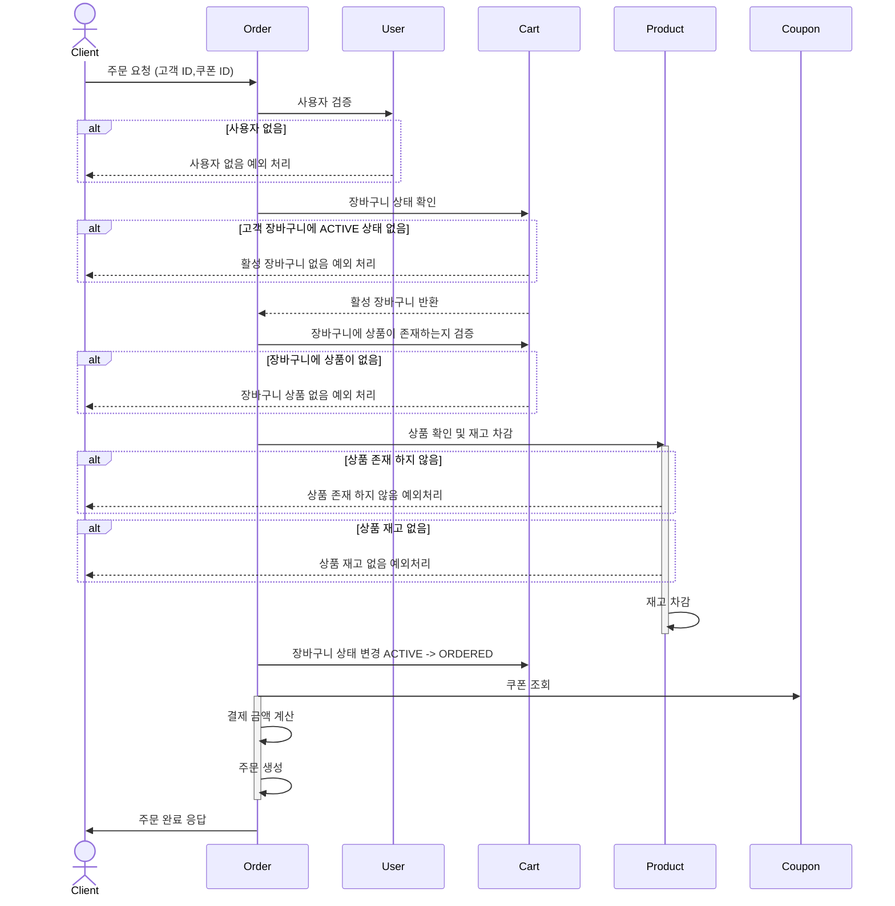

### 상태 다이어그램

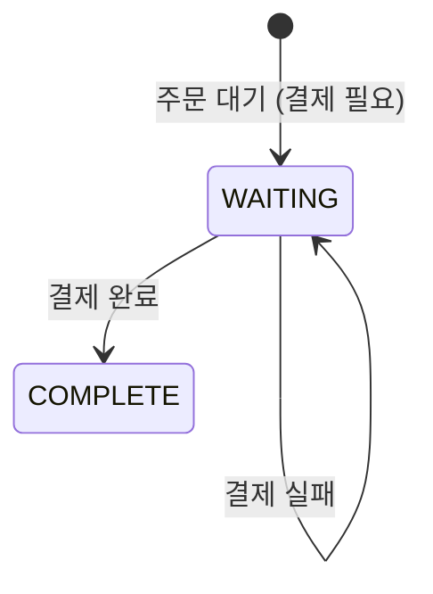

### 상태 enum

```java
/** 주문 상태 */
enum Order {
    WAITING, // 결제 대기
    COMPLETE // 결제 완료
}
```

## 📌 결제
> 결제를 처리합니다.

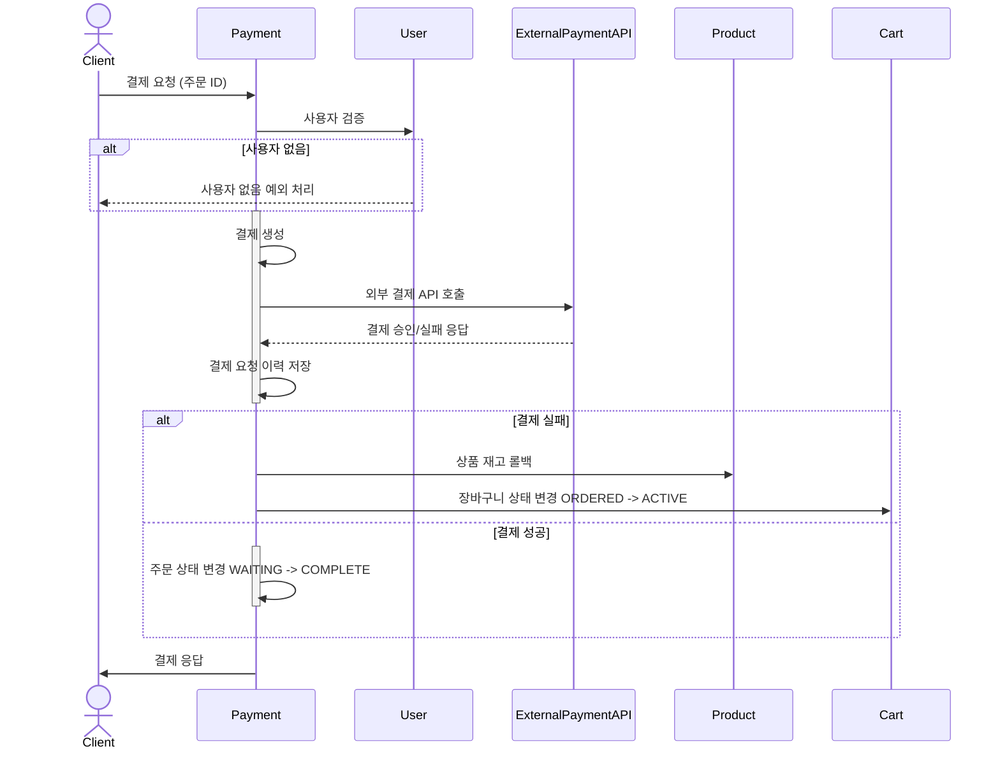

### 상태 enum
```java
/** 결제 상태 */
enum Payment {
    PENDING, // 결제 대기
    PAID, // 결제 완료
    FAILED // 결제 실패
}
```

## 📌 인기 상품 조회
> 최근 3일간 가장 많이 팔린 상위 5개 상품 정보를 제공
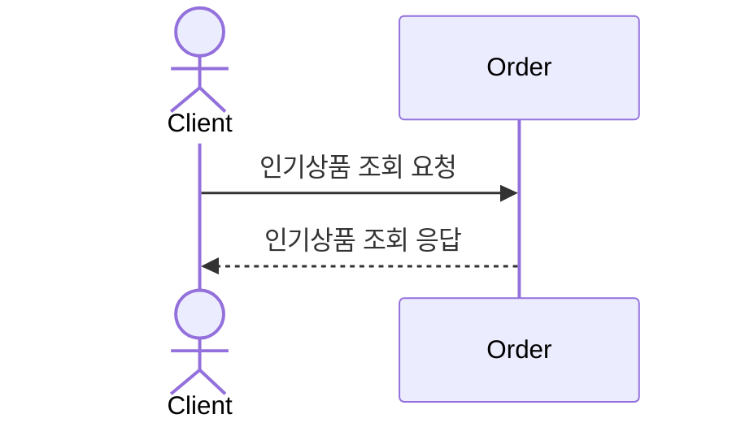