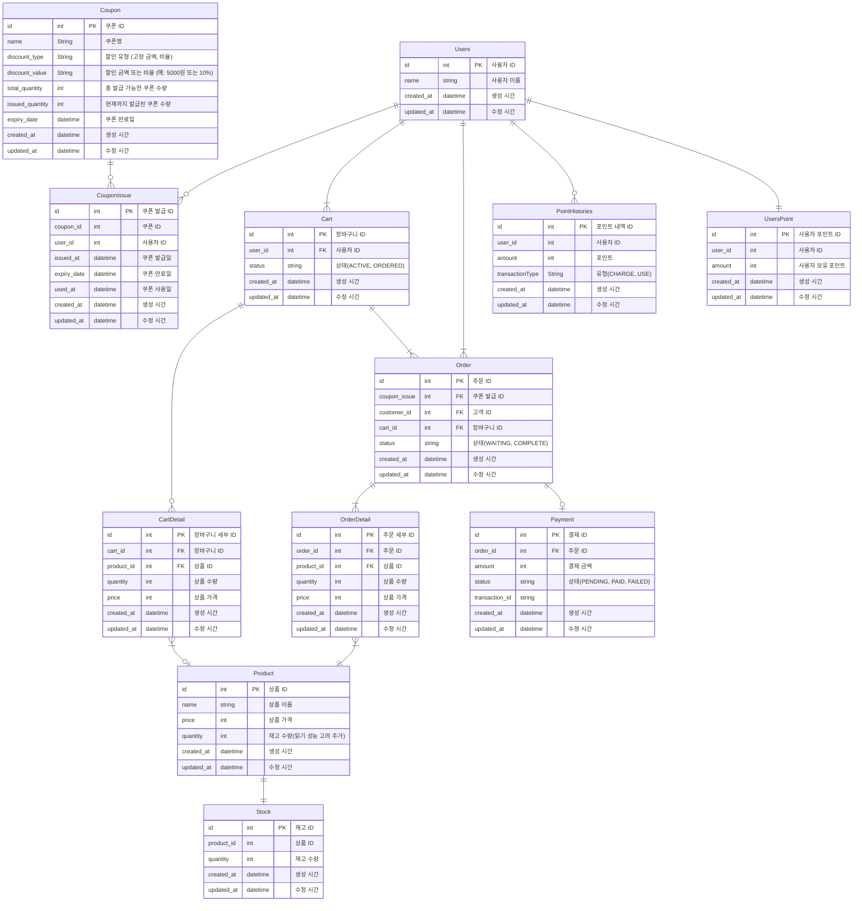

# ERD

```mermaid
erDiagram
    Users {
        id int PK "사용자 ID"
        name string "사용자 이름"
        created_at datetime "생성 시간"
        updated_at datetime "수정 시간" 
    }
    
    UsersPoint {
        id int PK "사용자 포인트 ID"
        user_id int "사용자 ID"
        amount int "사용자 보유 포인트"
        created_at datetime "생성 시간"
        updated_at datetime "수정 시간"
    }

    PointHistories {
        id int PK "포인트 내역 ID"
        user_id int "사용자 ID"
        amount int "포인트"
        transactionType String "유형(CHARGE, USE)"
        created_at datetime "생성 시간"
        updated_at datetime "수정 시간"
    }

    Product {
        id int PK "상품 ID"
        name string "상품 이름"
        price int "상품 가격"
        quantity int "재고 수량(읽기 성능 고려 추가)"
        created_at datetime "생성 시간"
        updated_at datetime "수정 시간"
    }

    Stock {
        id int PK "재고 ID"
        product_id int "상품 ID"
        quantity int "재고 수량"
        created_at datetime "생성 시간"
        updated_at datetime "수정 시간"
    }
    
    Coupon {
        id int PK "쿠폰 ID"
        name String "쿠폰명"
        discount_type String "할인 유형 (고정 금액, 비율)"
        discount_value String "할인 금액 또는 비율 (예: 5000원 또는 10%)"
        total_quantity int "총 발급 가능한 쿠폰 수량"
        issued_quantity int "현재까지 발급된 쿠폰 수량"
        expiry_date datetime "쿠폰 만료일"
        created_at datetime "생성 시간"
        updated_at datetime "수정 시간"
    }

    CouponIssue {
        id int PK "쿠폰 발급 ID"
        coupon_id int "쿠폰 ID"
        user_id int "사용자 ID"
        issued_at datetime "쿠폰 발급일"
        expiry_date datetime "쿠폰 만료일"
        used_at datetime "쿠폰 사용일"
        created_at datetime "생성 시간"
        updated_at datetime "수정 시간"
    }
        
    
    
    Cart {
        id int PK "장바구니 ID"
        user_id int FK "사용자 ID"
        status string "상태(ACTIVE, ORDERED)"
        created_at datetime "생성 시간"
        updated_at datetime "수정 시간"
    }

    CartDetail {
        id int PK "장바구니 세부 ID"
        cart_id int FK "장바구니 ID"
        product_id int FK "상품 ID"
        quantity int "상품 수량"
        price int "상품 가격"
        created_at datetime "생성 시간"
        updated_at datetime "수정 시간"
    }

    Order {
        id int PK "주문 ID"
        coupon_issue int FK "쿠폰 발급 ID"
        customer_id int FK "고객 ID"
        cart_id int FK "장바구니 ID"
        status string "상태(WAITING, COMPLETE)"
        created_at datetime "생성 시간"
        updated_at datetime "수정 시간"
    }

    OrderDetail {
        id int PK "주문 세부 ID"
        order_id int FK "주문 ID"
        product_id int FK "상품 ID"
        quantity int "상품 수량"
        price int "상품 가격"
        created_at datetime "생성 시간"
        updated_at datetime "수정 시간"
    }

    Payment {
        id int PK "결제 ID"
        order_id int FK "주문 ID"
        amount int "결제 금액"
        status string "상태(PENDING, PAID, FAILED)"
        transaction_id string
        created_at datetime "생성 시간"
        updated_at datetime "수정 시간"
    }

    Coupon ||--o{ CouponIssue : ""
    
    Users ||--o{ CouponIssue : ""
    Users ||--|{ Cart : ""
    Users ||--|{ Order : ""
    Users ||--o{ PointHistories : ""
    Users ||--|| UsersPoint : ""
    
    Cart ||--o{ CartDetail : ""
    Order ||--|{ OrderDetail : ""
    Cart ||--|{ Order : ""
    Order ||--o| Payment : ""

    Product ||--|| Stock : ""
    CartDetail }|--o| Product : ""
    OrderDetail }|--|| Product : ""
    
```
